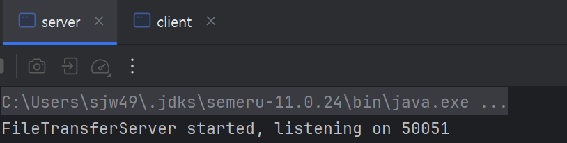
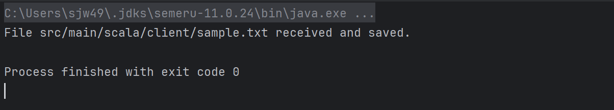
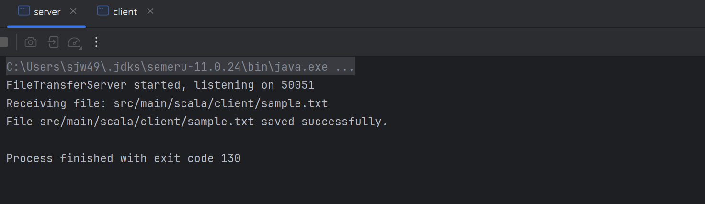

# gRPC : File transfer

JDK : 11

SDK : 2.13.15

SBT : 1.8.3

- build.sbt
    - 추가

```scala
Compile / PB.targets := Seq(
  scalapb.gen() -> (Compile / sourceManaged).value / "scalapb"
)

libraryDependencies ++= Seq(
  "io.grpc" % "grpc-netty" % scalapb.compiler.Version.grpcJavaVersion,
  "com.thesamet.scalapb" %% "scalapb-runtime-grpc" % scalapb.compiler.Version.scalapbVersion
)
```

- project/scalapb.sbt
    - 생성

```scala
**addSbtPlugin("com.thesamet" % "sbt-protoc" % "1.0.6")

libraryDependencies += "com.thesamet.scalapb" %% "compilerplugin" % "0.11.11"**
```

- main/protobuf/filetransfer.proto

```scala
syntax = "proto3";

package filetransfer;

service FileTransferService {
  rpc SendFile(FileChunk) returns (Ack);
}

message FileChunk {
  string filename = 1;
  bytes data = 2;
}

message Ack {
  string message = 1;
}

```

- server
    - client에게 파일 전송을 요청한다.

```scala
package server

import filetransfer.filetransfer.{Ack, FileChunk, FileTransferServiceGrpc}
import io.grpc.{Server, ServerBuilder}

import java.io.FileOutputStream
import scala.concurrent.{ExecutionContext, Future}

class FileTransferServer extends FileTransferServiceGrpc.FileTransferService {
  override def sendFile(request: FileChunk): Future[Ack] = {
    println(s"Receiving file: ${request.filename}")
    val savePath = s"src/main/scala/server/received_${request.filename.split("[/\\\\]").last}" // 경로 설정
    val output = new FileOutputStream(savePath)
    try {
      output.write(request.data.toByteArray)
      println(s"File ${request.filename} saved successfully.")
    } finally {
      output.close()
    }
    Future.successful(Ack(s"File ${request.filename} received and saved."))
  }
}

object FileTransferServer {
  def main(args: Array[String]): Unit = {
    val server: Server = ServerBuilder
      .forPort(50051)
      .addService(FileTransferServiceGrpc.bindService(new FileTransferServer, ExecutionContext.global))
      .build
      .start
    println("FileTransferServer started, listening on 50051")
    server.awaitTermination()
  }
}

```

- client
    - 요청을 받을 시 파일을 전송한다.

```scala
package client

import filetransfer.filetransfer.{FileChunk, FileTransferServiceGrpc}
import io.grpc.ManagedChannelBuilder

import java.nio.file.{Files, Paths}

object FileTransferClient {
  def main(args: Array[String]): Unit = {
    val channel = ManagedChannelBuilder.forAddress("localhost", 50051).usePlaintext().build
    val blockingStub = FileTransferServiceGrpc.blockingStub(channel)

    val filename = "src/main/scala/client/sample.txt" // 파일 이름 (예제용)
    val filePath = Paths.get(filename)
    if (Files.exists(filePath)) {
      val fileBytes = Files.readAllBytes(filePath)
      val request = FileChunk(filename = filename, data = com.google.protobuf.ByteString.copyFrom(fileBytes))

      val response = blockingStub.sendFile(request)
      println(response.message)
    } else {
      println(s"File $filename does not exist.")
    }

    channel.shutdown()
  }
}

```






